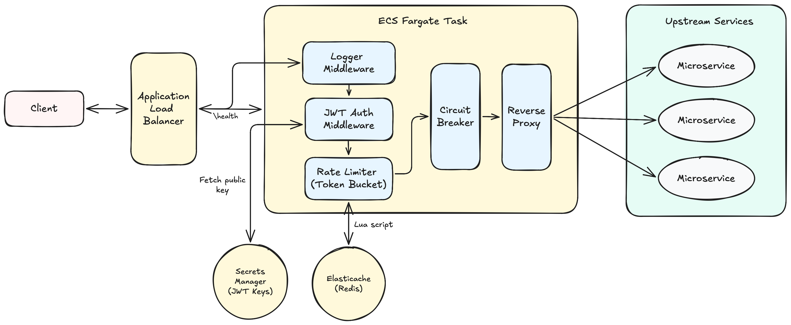

# API Gateway

A production-style API Gateway written in Go. It sits in front of backend services and centralizes authentication, Redis-backed rate limiting, and request routing through a pluggable middleware pipeline. Deployed on AWS ECS Fargate behind an Application Load Balancer, with a fully automated CI/CD pipeline via GitHub Actions.

Built to understand how production gateways like Kong, AWS API Gateway, and NGINX work under the hood — reverse proxying, middleware composition, distributed state, and cloud networking.

## Architecture



A request flow:

```
Client → ALB → ECS Fargate (Logger → JWT Auth → Rate Limiter → Circuit Breaker → Reverse Proxy) → Upstream service
```

The gateway never trusts the upstream service to handle auth or rate limiting — both are enforced once, centrally, before any request reaches the backend.

## Demo

[Demo video link here]

The recording shows the deployed gateway end to end: health check, a request rejected with `401` due to a missing JWT, the same request succeeding with a valid token, and a burst of requests triggering `429` once the rate limit is hit — all visible in real time through CloudWatch logs.

## Load test

`hey -n 50 -c 5` against the deployed ALB endpoint, with the rate limiter configured for a low threshold to verify enforcement under concurrent load:

```
Summary:
  Total:        1.2321 secs
  Requests/sec: 40.58

Status code distribution:
  [200]  6 responses
  [429]  44 responses

Latency distribution:
  50% in 0.0866 secs
  90% in 0.2600 secs
  95% in 0.2702 secs
```

6 requests got through before the bucket emptied, the remaining 44 were rejected with `429` — the Redis-backed Lua script correctly serialized concurrent token checks across 5 simultaneous workers with no over-admission.

## Features

**Reverse proxy** — routes incoming requests to configured upstream services based on path prefix matching, using Go's `httputil.ReverseProxy`.

**Middleware pipeline** — a composable chain (logger → auth → rate limiter → circuit breaker) where each concern is isolated. Adding or removing a middleware doesn't touch the others.

**JWT authentication** — verifies RS256-signed tokens against a public key. Routes are individually configurable as protected or open. The algorithm is explicitly checked to prevent algorithm-confusion attacks.

**Rate limiting** — a token bucket limiter backed by a single Redis (ElastiCache) instance, implemented with an atomic Lua script so concurrent requests can't race on the same client's token count. Because state lives in Redis rather than in-process, the limit holds correctly even if the gateway runs as multiple ECS tasks — they all share one counter per client instead of each task tracking its own. This is shared-state rate limiting, not a fully distributed one: there is a single Redis node, so it's also a single point of failure for the limiter itself. Fails closed if Redis is unreachable, prioritizing security over availability.

**Circuit breaker** — tracks upstream failure rate per service and fast-fails with a `503` once a threshold is crossed, instead of letting every request time out against a dead upstream. Recovers automatically through a half-open probe state.

**Graceful shutdown** — listens for `SIGTERM`/`SIGINT`, stops accepting new connections, and lets in-flight requests finish before exiting. Required for clean ECS rolling deployments.

**Structured logging** — every request gets a unique ID, logged on entry and exit with method, path, status code, and latency.

## Tech stack

Go · Redis (ElastiCache) · Docker · AWS (ECS Fargate, ALB, ElastiCache, Secrets Manager, CloudWatch, VPC Endpoints) · GitHub Actions

## Design decisions

**Token bucket over sliding window.** Sliding window is more precise but requires storing every request timestamp in Redis, which gets memory-heavy at scale. Token bucket only needs two values per client (token count, last refill time), allows controlled bursts, and is the approach used by AWS, Stripe, and GitHub's own rate limiters.

**RS256 over HS256.** With RS256 the gateway only holds the public key, never the private signing key. A compromised gateway can verify tokens but can't forge new ones — a meaningfully smaller blast radius than a shared HMAC secret.

**Fail closed on Redis unavailability.** If Redis goes down, the rate limiter rejects requests rather than letting everything through. The gateway exists to protect upstream services from abuse; if it can't enforce that protection, it shouldn't pretend to.

**VPC endpoints over public internet routing.** ECS Fargate tasks reach ECR, CloudWatch Logs, and Secrets Manager through interface VPC endpoints rather than the public internet, keeping AWS-to-AWS traffic inside the VPC.

**TLS to ElastiCache.** The ElastiCache cluster has encryption in transit enabled, so the Redis client connects over TLS rather than plaintext TCP.

## Running locally

```bash
docker-compose up
```

Spins up the gateway and a local Redis container. Generate a test JWT with the included minting tool:

```bash
go run cmd/mint/mint.go
```

Test the pipeline:

```bash
curl http://localhost:8080/health

curl http://localhost:8080/api/protected
# 401, no token

curl -H "Authorization: Bearer <token>" http://localhost:8080/api/protected
# 200, proxied through
```

## Configuration

All runtime behavior is controlled through `config.yaml` — server port, upstream routes with per-route auth flags, rate limit thresholds (max tokens, refill rate), and the JWT public key path. Nothing is hardcoded in the source.

## AWS deployment

The gateway runs on ECS Fargate (Graviton/ARM64 task definition) behind an ALB, with ElastiCache (Redis, cluster mode) holding rate limit state shared across gateway tasks, and Secrets Manager for the JWT public key. ECR stores the container image, and four VPC interface/gateway endpoints (`ecr.api`, `ecr.dkr`, `logs`, `s3`) keep ECR/CloudWatch/Secrets Manager traffic off the public internet.

GitHub Actions (`.github/workflows/deploy.yml`) runs on every push to main: cross-compiles the image for `linux/arm64` using QEMU and Docker Buildx, pushes to ECR, and forces a new ECS rolling deployment.

The infrastructure is not kept running continuously to avoid ongoing AWS costs — see the demo video and load test above for proof of a live deployment.

## Project structure

```
.
├── main.go                 # Entry point, server setup, graceful shutdown
├── config/
│   ├── config.go            # Config loading
│   └── pem.go                # JWT public key loading (file or Secrets Manager)
├── middleware/
│   ├── middleware.go      # Chain composition
│   ├── logger.go             # Request logging
│   ├── auth.go                # JWT verification
│   └── ratelimit.go         # Token bucket rate limiter
├── proxy/
│   ├── proxy.go               # Reverse proxy handler
│   └── circuit_breaker.go # Circuit breaker state machine
├── router/
│   └── router.go             # Path-to-upstream matching
├── health/
│   └── health.go             # /health endpoint
├── scripts/
│   └── rate_limit.lua       # Atomic token bucket Lua script
├── cmd/mint/
│   └── mint.go                # Dev tool: mints test JWTs
├── Dockerfile                 # Multi-stage build, cross-compiled for linux/arm64
├── docker-compose.yml    # Local dev: gateway + Redis
└── config.yaml                # Runtime configuration
```

## Challenges

A few things that took real debugging during the AWS deployment, worth knowing for anyone extending this:

- **ElastiCache TLS.** With encryption in transit enabled on the cluster, the Redis client needs an explicit TLS config — connecting over plain TCP just hangs with no useful error. Traced this by running a throwaway ECS task with `redis-cli --tls` to isolate whether it was a networking problem or a protocol problem.
- **Fargate-to-AWS-service connectivity.** Tasks couldn't reach ECR or ElastiCache despite correct security groups, route tables, and NACLs — the actual fix was VPC interface endpoints (`ecr.api`, `ecr.dkr`, `logs`) and a gateway endpoint (`s3`), since Fargate tasks route AWS API calls through these rather than the public internet by default in this setup.
- **Platform architecture mismatches.** Docker images built on Apple Silicon default to `arm64`, while the first Fargate task definition expected `x86_64` — caused a silent `CannotPullContainerError`. Fixed by aligning the ECS task definition's CPU architecture to ARM64/Graviton and being explicit about target platform in the Dockerfile and CI build step, rather than fighting the native build architecture.
- **VPC endpoint security groups.** The endpoints needed their own inbound rule allowing HTTPS from the ECS task security group — easy to miss since it's a separate security boundary from the ECS task's own inbound/outbound rules.

## Future improvements

- True multi-shard ElastiCache rate limiting to remove the single Redis node as a point of failure
- Scope VPC endpoint policies down to specific resource ARNs instead of full access
- NAT Gateway instead of public IPs on ECS tasks, for a fully private subnet
- Request/response transformation middleware
- Per-route rate limit configuration instead of one global limit

---

Built by [Joel Josy](https://github.com/JoelJosy)